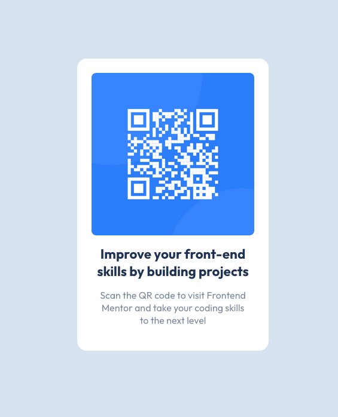

# Frontend Mentor - QR code component solution

This is a solution to the [QR code component challenge on Frontend Mentor](https://www.frontendmentor.io/challenges/qr-code-component-iux_sIO_H). Frontend Mentor challenges help you improve your coding skills by building realistic projects.  

## Table of contents

- [Overview](#overview)
  - [Screenshot Card](#screenshot)
  - [Links](#links)
- [My process](#my-process)
  - [Built with](#built-with)
  - [What I learned](#what-i-learned)
  - [Continued development](#continued-development)
- [Author](#author)

---

## Overview

### Screenshot



### Links

- Solution URL: [Frontend solution](https://www.frontendmentor.io/solutions/profile-card-component-using-flexbox-ubjyu9jz5B)
- Live Site URL: [Live site with GitHub Pages](https://marioferrer.github.io/FM-01_profile-card-component/)

## My process

### Built with

- Semantic HTML5 markup
- SCSS
- SCSS Mixins
- Flexbox


### What I learned

I found this challenge quite easy. I have improved the SCSS nesting although I still have a hard time working with it.

I have used the SCSS @mixins, I am satisfied.
Here is an example, the code is this:


```scss
@mixin flex($direction, $justify, $align, $wrap) {
  display: flex;
  flex-direction: $direction;
  justify-content: $justify;
  align-items: $align;
  flex-wrap: $wrap;
}

body {
  @include flex(row, center, center, nowrap);
}
```

### Continued development

I have to keep working and improving SCSS nesting.

### Mentions

I have used and modified Eduardo Fierro's reset, here is his github profile. <br>
[Eduardo's github profile](https://github.com/eduardofierropro/Reset-CSS)

## Author

- Github - [My GitHub Profile](https://github.com/marioferrer)
- Frontend Mentor - [@marioferrer](https://www.frontendmentor.io/profile/marioferrer)


